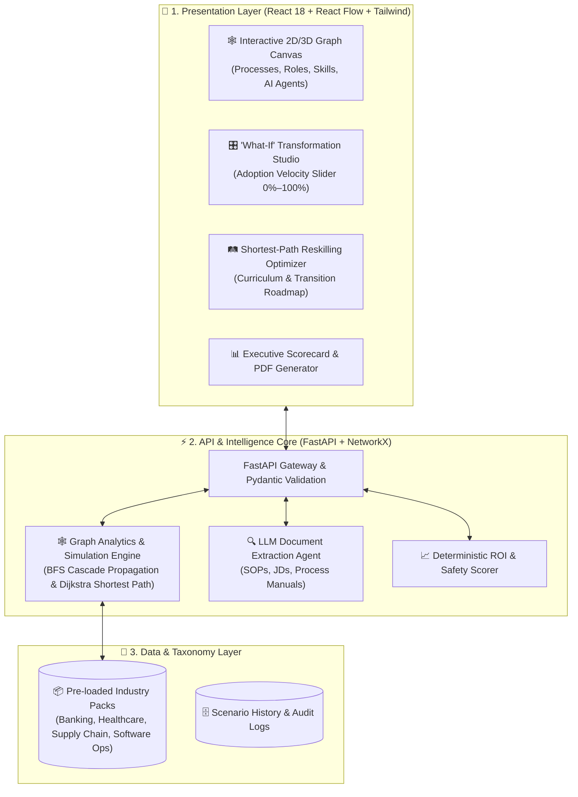

# 🕸️ NexusTransform AI
### *Process × Role × Skill Intelligence Graph Platform*
> **Enterprise AI Transformation Platform — Built for Stage 2 Submission**  
> *Developed by Rituraj Tiwari (MCA, IET Lucknow)*

---

[](https://fastapi.tiangolo.com)
[](https://reactjs.org)
[](https://reactflow.dev)
[](https://networkx.org)
[](https://www.docker.com)
[](https://pytest.org)

---

## 📌 1. Executive Summary

Most enterprise AI transformations fail because organizations operate in functional silos:
* **Operations** understands *Processes* (workflows, bottlenecks, SLAs).
* **HR & Leadership** understand *Job Roles* (headcounts, titles, compensation).
* **Learning & Development** understands *Skills* (competencies, training gaps).

**NexusTransform AI** unifies all three dimensions into a living, computable, and interactive **Multi-Dimensional Knowledge Graph**:
$$\text{Business Process} \longleftrightarrow \text{Job Role} \longleftrightarrow \text{Human Skill} \longleftrightarrow \text{AI Agent}$$

It enables corporate executives, Chief Transformation Officers, and HR leaders to visually simulate AI interventions, measure exact operational ROI, safeguard compliance governance, and compute algorithmic reskilling pathways for displaced workers.

---

## 🏗️ 2. High-Level Architecture



---

## 🌟 3. Key Features

### 1. 🕸️ Multi-Dimensional Interactive Knowledge Graph
* Dynamic 2D force-directed graph canvas built with **React Flow**.
* Color-coded node clusters:
  * 🔷 **Business Processes** (Throughput & complexity metrics)
  * 🟢 **Job Roles** (Headcounts, salary benchmarks, impact status)
  * 🟡 **Competencies/Skills** (Prerequisites, difficulty levels)
  * 🟣 **Autonomous AI Agents** (Throughput efficiency meters)

### 2. 🎛️ Real-Time "What-If" Transformation Simulator
* Adjust AI adoption velocity from **0% (Baseline)** to **100% (Autonomous)**.
* Real-time **BFS cascade propagation** recalculates:
  * 💰 **Net Annual Operational Savings ($)**
  * ⚡ **Enterprise Automation Index (%)**
  * 👥 **Augmented vs. Displaced Headcount**
  * ⏱️ **Annual Productive Hours Reclaimed**
  * 🛡️ **Human-in-the-Loop (HITL) Safety Governance Score**

### 3. 🛤️ Algorithmic Shortest-Path Reskilling Optimizer
* Select any displaced legacy role and target future AI-augmented role.
* Calculates the optimal transition roadmap using graph proximity and skill deltas.
* Generates a **3-stage fast-track curriculum**, estimated training duration (weeks), and budget comparison (~70% cheaper than external recruiting).

### 4. 📄 Autonomous SOP & Job Description Ingestion Agent
* Upload or paste any custom enterprise SOP, process manual, or job description.
* Extraction agent extracts structured entities (`Processes`, `Roles`, `Skills`, `AI Opportunities`) and connects them into the live graph in real time.

### 5. 📑 1-Click C-Level Executive Dossier Export
* Generates audit-ready, high-resolution **PDF Executive Transformation Briefs** with live financial metrics, risk governance indicators, and topology breakdowns.

---

## 📦 4. Pre-Loaded Industry Ontologies

| Industry Pack | Domain Focus | Key Processes & Interventions |
| :--- | :--- | :--- |
| **Banking & Insurance Claims** | Claims Adjudication & Underwriting | Intake OCR, Policy Verification, Fraud Sentinel Agent, Auto-Adjudication Copilot |
| **Healthcare Clinical Operations** | Clinical Triage & Pharmacovigilance | Patient Intake, Ambient EHR Scribing, Genomic Trial Matching, Adverse Drug Event Triage |
| **Retail & E-Commerce Supply Chain** | Logistics & Warehouse Replenishment | Demand Sensing, Autonomous Fleet Route Dispatch, Returns (RMA) Inspection |
| **Enterprise Software & Cloud Ops** | SDLC, CI/CD & Reliability Engineering | PR Code Review, Autonomous QA Test Synthesis, Incident Mitigation, SRE Copilot |

---

## 🚀 5. Quickstart & Local Setup

### Prerequisites
* **Python 3.10+**
* **Node.js 18+** & npm
* *(Optional)* **Docker & Docker Compose**

---

### Option A: Run with Docker Compose (Recommended - 1 Command)
```bash
# Clone repository
git clone https://github.com/riturajtiwari/nexus-transform-ai.git
cd nexus-transform-ai

# Build and run containers
docker-compose up --build
```
* **Frontend UI:** Open [http://localhost:3000](http://localhost:3000)
* **Backend API Docs:** Open [http://localhost:8000/docs](http://localhost:8000/docs)

---

### Option B: Run Locally (Manual)

#### 1. Backend Setup (FastAPI)
```bash
cd backend

# Install dependencies
pip install -r requirements.txt

# Run automated test suite
python -m pytest tests/ -v

# Start FastAPI server
python -m uvicorn main:app --host 127.0.0.1 --port 8000 --reload
```

#### 2. Frontend Setup (React + Vite)
```bash
cd frontend

# Install dependencies
npm install

# Start Vite dev server
npm run dev
```
* Access the web dashboard at `http://localhost:3000` or `http://localhost:5173`.

---

## 🧪 6. Testing & Quality Assurance

```bash
cd backend
python -m pytest tests/ -v
```

**Test Coverage Highlights:**
* ✅ `test_api_health`: Verifies REST API gateway health.
* ✅ `test_list_industries`: Validates all 4 pre-loaded industry ontologies.
* ✅ `test_get_graph_data`: Verifies node/edge topology integrity.
* ✅ `test_simulation_engine`: Validates BFS cascade impact and financial ROI math.
* ✅ `test_reskilling_optimizer`: Validates shortest-path curriculum generation.
* ✅ `test_document_ingestion`: Validates entity extraction from unstructured SOP text.

---

## 📂 7. Repository Structure

```text
nexus-transform-ai/
├── backend/
│   ├── app/
│   │   ├── api/endpoints.py        # REST API endpoints (/simulate, /reskill, /ingest)
│   │   ├── core/config.py          # App settings & CORS configuration
│   │   ├── models/graph_models.py  # Pydantic v2 domain schemas
│   │   ├── services/graph_service.py # NetworkX graph traversal & simulation engine
│   │   ├── agents/extractor_agent.py # SOP/JD unstructured document parser
│   │   └── data/industry_datasets.py # 4 Pre-loaded industry ontology packs
│   ├── tests/test_graph_engine.py  # Automated Pytest suite
│   ├── Dockerfile
│   ├── requirements.txt
│   └── main.py
│
├── frontend/
│   ├── src/
│   │   ├── components/             # React Flow Canvas, SimulationDeck, ReskillModal, MetricsBar
│   │   ├── services/api.ts         # Axios API client with offline fallback
│   │   ├── types/graph.ts          # TypeScript interfaces
│   │   ├── data/mockData.ts        # Offline fallback datasets
│   │   ├── App.tsx                 # Main application dashboard
│   │   └── main.tsx
│   ├── Dockerfile
│   ├── package.json
│   ├── tailwind.config.js
│   └── vite.config.ts
│
├── docker-compose.yml
├── .gitignore
└── README.md
```

---

## 👤 Author
* **Rituraj Tiwari**  
* Master of Computer Applications (MCA), *Institute of Engineering and Technology (IET Lucknow)*  
* Bachelor of Science in Mathematics (Honours), *Bangabasi College, Kolkata*  
* Email: [riturajtiwari608@gmail.com](mailto:riturajtiwari608@gmail.com)  
* LinkedIn: [linkedin.com/in/rituraj-tiwari-013b30197](https://linkedin.com/in/rituraj-tiwari-013b30197)
